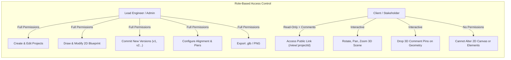
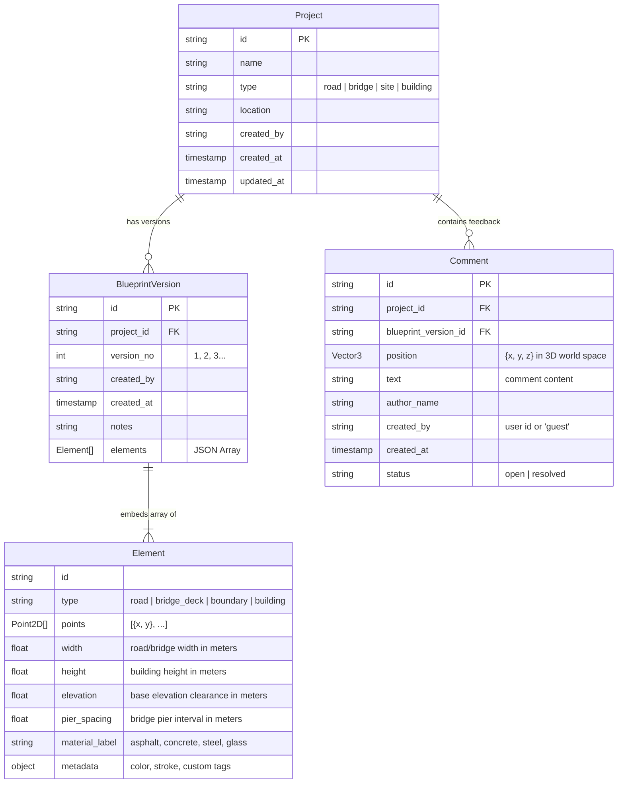
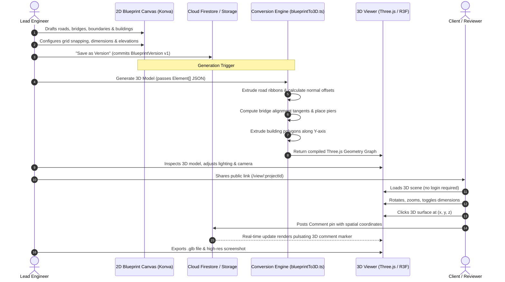

# Blueprint-to-3D Model Tool — System Design Document

**Document Version:** 1.0.0  
**Status:** Approved for MVP  
**Target Audience:** Engineering Team, Product Leadership, Client Stakeholders  

---

## 1. Executive Summary & Core Value Proposition

The **Blueprint-to-3D Model Tool** enables civil and structural engineering teams, contractors, and developers to draft 2D civil alignments and architectural site plans directly inside an in-app canvas editor and instantaneously transform them into an interactive, photorealistic, dimensional 3D model. 

### The Core Pitch
> *"Before breaking ground, walk your client through the actual project in 3D and achieve stakeholder sign-off via a single web link, instead of static 2D paper blueprints."*

By shifting early design communication from abstract 2D CAD plots to an interactive 3D spatial review, construction companies eliminate costly misinterpretations, expedite approval cycles, and instill client trust.

---

## 2. Feature Specification (MVP vs. Phase 2)

### 2.1 MVP Scope (Included)

| Module | Features & Capabilities |
| :--- | :--- |
| **A. 2D Blueprint Editor** | • **Vector Drawing Canvas** powered by HTML5 / `react-konva`<br>• **Road Tool**: Polyline path with continuous width ($w$) in meters and elevation offset ($z$)<br>• **Bridge Tool**: Alignment polyline, deck width, pier spacing interval, and base elevation clearance<br>• **Boundary / Plot Tool**: Closed 2D polygon with perimeter and area calculation<br>• **Building / Structure Tool**: Rectangular or polygonal footprint with parametric height ($h$)<br>• **Precision Snapping**: Snap-to-grid (1m, 5m intervals) and direct numerical dimension inputs<br>• **Properties Inspector**: Edit width, height, elevation, and material classification metadata<br>• **Version Control**: Save revisions as discrete versions (`v1`, `v2`, `v3`) with audit trail |
| **B. Auto 3D Model Generation** | • **Instantaneous 1-Click Synthesis**: Pure functional pipeline converting 2D elements to 3D geometry<br>• **Road Extrusion**: Planar ribbon extruded along 2D polyline with road crown and curbs<br>• **Bridge Synthesis**: Extruded deck slab, structural longitudinal girders, and parametric vertical piers auto-placed at defined intervals along alignment tangents<br>• **Building & Plot Extrusion**: Polygon upward prism extrusion with roof cap and wall facings<br>• **Stylized Engineering Aesthetic**: High clarity, clean edges, and distinct material shading |
| **C. 3D Viewer (Client-Facing)** | • **Full Orbit Controls**: Smooth 360° rotate, pan, and zoom with camera angle presets (Isometric, Top-Down, Eye-Level Walkthrough)<br>• **Dimension & Label Overlays**: Toggle 3D measurement tags and spatial annotations<br>• **Spatial Pin Commenting**: Click directly on any 3D surface to drop a geotagged comment pin<br>• **Public Shareable Route**: `/view/:projectId` accessible without authentication |
| **D. Cross-Cutting Utilities** | • **Dual User Roles**: Admin/Engineer (full authoring) vs. Client (read & comment only)<br>• **Client-Side Export**: High-resolution PNG screenshot capture and binary `.glb` (GLTF) 3D model download<br>• **Version Comparison**: Inspect previous blueprint versions and their respective 3D representations |

### 2.2 Phase 2 Scope (Explicitly Out of Scope for MVP)
- Automated PDF / DWG raster CAD parsing or computer vision vectorization.
- Photorealistic ray-traced materials, environmental weather simulations, or physically accurate shaders.
- Automated cost estimation takeoff and Bill of Quantities (BOQ) calculation.
- Structural engineering load analysis, stress calculations, or building code compliance validation.

---

## 3. User Roles & Permissions

The application distinguishes between two primary personas:



### 1. Engineer / Admin
- **Goal:** Draft project blueprints, define dimensions/elevations, generate 3D versions, and send review links to clients.
- **Access:** Authenticated access via Firebase Auth (email/password or SSO). Complete read/write privileges over projects, blueprint versions, elements, and comments.

### 2. Client / Stakeholder
- **Goal:** Inspect proposed construction design in 3D, verify spatial relationships, and leave targeted feedback before construction commences.
- **Access:** Zero-friction unauthenticated access via dedicated public URL (`/view/:projectId`). Read-only access to project metadata and blueprint geometry; create permission on the spatial comments collection.

---

## 4. Data Model & Entity Relationships

The data structure is optimized for document-oriented storage (Google Cloud Firestore), featuring embedded element arrays for atomic blueprint version snapshots and a separate subcollection for real-time collaborative comments.



### JSON Schema Definitions

#### Element Object (Embedded in `BlueprintVersion.elements`)
```json
{
  "id": "elem_bridge_01",
  "type": "bridge_deck",
  "points": [
    { "x": 0, "y": 100 },
    { "x": 150, "y": 100 },
    { "x": 300, "y": 140 }
  ],
  "width": 12.0,
  "height": 1.5,
  "elevation": 8.0,
  "pier_spacing": 25.0,
  "material_label": "reinforced_concrete",
  "metadata": {
    "lanes": 2,
    "hasSidewalk": true
  }
}
```

#### Comment Object
```json
{
  "id": "comment_9941",
  "project_id": "proj_state_hwy_4",
  "blueprint_version_id": "ver_02",
  "position": { "x": 150.2, "y": 8.0, "z": -100.1 },
  "text": "Can we increase vertical clearance at pier 6 for agricultural vehicle passage?",
  "author_name": "Municipal Inspector",
  "created_by": "client_session_881",
  "created_at": "2026-09-10T14:30:00Z",
  "status": "open"
}
```

---

## 5. End-to-End System Workflow

The architecture follows a uni-directional flow from 2D vector input to pure geometric translation, Three.js scene graph rendering, and collaborative stakeholder interaction.



### Processing Pipeline Details

1. **2D Drafting Phase:**
   - Engineer works in a 2D top-down coordinate plane where $1\text{ canvas unit} = 1\text{ meter}$.
   - Elements are drawn using polyline and polygon primitives with snap-to-grid guidance.
   - When finalized, the elements array is validated and serialized into Firestore under `BlueprintVersion`.

2. **Geometric Synthesis Phase (`blueprintTo3D.ts`):**
   - Pure functional transformation: accepts `Element[]` and returns structured Three.js mesh descriptors.
   - **Roads:** Takes 2D points, evaluates segment normals, computes left/right vertex offsets at $\pm \frac{w}{2}$, and builds a continuous triangulated ribbon with road-crown bevel.
   - **Bridges:** Builds deck extrusion slab at base elevation $z$; samples path length at uniform intervals of `pier_spacing`; projects vertical column piers downward from deck bottom to ground grade ($y = 0$).
   - **Buildings:** Converts 2D polygon vertices into a 2D `THREE.Shape`, executes `THREE.ExtrudeGeometry` with height $h$, and computes UV coordinates for clean architectural edges.

3. **Client Review & Feedback Phase:**
   - The scene is rendered using `@react-three/fiber` with soft directional shadows and an ambient construction skybox.
   - Clients interact via OrbitControls. Clicking invokes raycasting against the scene's bounding volume hierarchy (BVH) to capture world coordinates $(x, y, z)$ and attach discussion threads.
