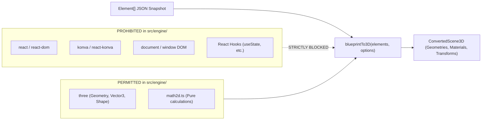
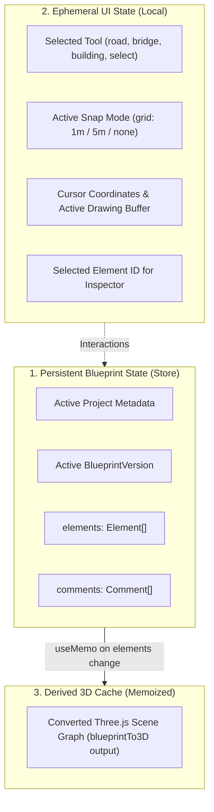

# Blueprint-to-3D Model Tool — Engineering Rules & Conventions

**Document Version:** 1.0.0  
**Status:** Active  
**Enforcement:** Mandatory across all codebase contributions  

---

## 1. Directory & Codebase Architecture

The project maintains strict architectural separation between user interface layers, canvas drafting, 3D rendering, and geometric computation.

```
demo/
├── docs/                      # Governing documentation (DESIGN, RULES, SKILLS)
├── public/                    # Static assets, fonts, site icons
├── src/
│   ├── components/            # UI components (React)
│   │   ├── common/            # Reusable primitives (Buttons, Modals, Badges, Tooltips)
│   │   ├── editor/            # 2D Canvas drafting components (Konva-backed)
│   │   │   ├── BlueprintCanvas.tsx
│   │   │   ├── CanvasGrid.tsx
│   │   │   ├── EditorToolbar.tsx
│   │   │   ├── ElementInspector.tsx
│   │   │   └── DimensionOverlay.tsx
│   │   ├── viewer3d/          # 3D Scene components (@react-three/fiber-backed)
│   │   │   ├── SceneContainer.tsx
│   │   │   ├── ModelRenderer.tsx
│   │   │   ├── CommentPinLayer.tsx
│   │   │   ├── EnvironmentRig.tsx
│   │   │   └── CameraController.tsx
│   │   ├── layout/            # Shell, Navigation, Split-screen views
│   │   └── client/            # Read-only client review presentation mode
│   ├── engine/                # Framework-Agnostic Mathematical & Geometry Core
│   │   ├── blueprintTo3D.ts   # PURE conversion: Element[] -> 3D Mesh Descriptors
│   │   ├── math2d.ts          # Vector math, polygon triangulation, polyline offsets
│   │   └── exporters.ts       # Headless GLTF / OBJ data serialization
│   ├── services/              # External integrations & Persistence
│   │   ├── firebase.ts        # Firebase app, Auth, and Firestore instances
│   │   ├── repository.ts      # Repository pattern: Firestore with local fallback
│   │   └── exportService.ts   # Client-side GLTF download & PNG canvas capture
│   ├── hooks/                 # Custom React hooks (useBlueprint, useComments, useTool)
│   ├── store/                 # State management layer (Zustand or Context store)
│   ├── types/                 # TypeScript interfaces and domain schemas
│   │   └── index.ts
│   ├── App.tsx                # App entrypoint and top-level routing
│   ├── main.tsx               # DOM mount point
│   └── index.css              # Tailwind directives and custom CSS utilities
├── firestore.rules            # Firebase Security Rules
├── tailwind.config.js         # Design tokens & color system
├── tsconfig.json              # Strict TypeScript configuration
└── vite.config.ts             # Vite bundler configuration
```

---

## 2. Component Naming & Coding Standards

1. **Naming Conventions:**
   - **React Components:** PascalCase with descriptive suffixes (`BlueprintCanvas.tsx`, `ElementInspector.tsx`, `CommentPinLayer.tsx`).
   - **Hooks:** camelCase with `use` prefix (`useBlueprintState.ts`, `useCanvasHotkeys.ts`).
   - **Pure Utilities / Mathematical Modules:** camelCase (`blueprintTo3D.ts`, `math2d.ts`).
   - **Type Definition Files:** camelCase or `index.ts` within `src/types/`.

2. **Single Responsibility Principle:**
   - A component must not intermingle 2D drawing logic with 3D scene creation.
   - Drawing event handlers (e.g. mouse clicks, drag events on Konva nodes) reside exclusively in `src/components/editor/`.
   - Three.js hooks (`useFrame`, `useThree`) reside exclusively in `src/components/viewer3d/`.

3. **TypeScript Strictness:**
   - Strict mode enabled (`"strict": true` in `tsconfig.json`).
   - Explicit return types on all exported functions.
   - Zero `any` types permitted; use disciminated unions for element types (`type Element = RoadElement | BridgeElement | BuildingElement | BoundaryElement`).

---

## 3. Framework-Agnostic Conversion Engine (`blueprintTo3D.ts`)

### Purity Contract:
The conversion engine is the algorithmic foundation of the application. It **must remain 100% framework-agnostic**.



### Conversion Engine Rules:
1. **Zero Framework Dependencies:**
   - Never import `react`, `react-konva`, `konva`, or reference the browser DOM (`window`, `document`) inside `src/engine/`.
2. **Pure Functions:**
   - Given the identical `Element[]` array and coordinate parameters, `blueprintTo3D()` must always output identical 3D geometric structures without side effects.
3. **Independent Testability:**
   - The engine must be runnable in pure Node.js / Vitest environments without a browser runtime or canvas mock.
4. **Coordinate Mapping Standard:**
   - **2D Canvas Space:** $X$ (East-West), $Y$ (North-South). $1\text{ unit} = 1\text{ meter}$.
   - **3D World Space:** Three.js standard coordinates:
     - $X_{3D} = X_{2D}$
     - $Y_{3D} = \text{Elevation } (Z_{2D}) + \text{height extrusion}$ (Up/Down)
     - $Z_{3D} = -Y_{2D}$ (North-South mapping to depth)

---

## 4. State Management Strategy

To ensure fluid interactivity between the 2D canvas and 3D preview, state is partitioned into three distinct tiers:



- **Undo / Redo Buffer:** Maintains element stack history during 2D drafting sessions.
- **Version Snapshotting:** When the engineer clicks "Commit Version", a deep clone of `elements[]` is created and assigned a new incremental `version_no`.
- **Derived 3D Invalidation:** 3D geometry regeneration is memoized against the hash of `elements[]` to prevent redundant vertex re-allocations during non-geometric UI updates.

---

## 5. UI & Tailwind CSS Conventions

### Color Palette & Visual Theme
The interface implements a high-end, modern industrial engineering aesthetic (dark slate baseline with electric blueprint cyan and hazard amber accents).

```javascript
// tailwind.config.js theme extension preview
colors: {
  slate: {
    850: '#151E2E',
    950: '#0B0F17',
  },
  blueprint: {
    400: '#38BDF8',
    500: '#0EA5E9',
    600: '#0284C7',
    glow: 'rgba(14, 165, 233, 0.25)',
  },
  hazard: {
    400: '#FBBF24',
    500: '#F59E0B',
  }
}
```

### Styling Guidelines:
1. **Dark Mode by Default:** Civil CAD software and engineering viewers demand low eye strain and high contrast. Use `bg-slate-950` as the canvas foundation.
2. **Glassmorphic Floating Panels:** Floating toolbars, element inspectors, and comment cards use translucent backdrops with subtle borders (`bg-slate-900/80 backdrop-blur-md border border-slate-800/80 shadow-2xl`).
3. **Interactive Affordances:** Active drawing tools, hovered nodes, and selected elements must feature clear glowing outlines (`ring-2 ring-blueprint-500 shadow-[0_0_15px_rgba(14,165,233,0.3)]`).
4. **No Arbitrary CSS:** All colors, spacing, and sizing must adhere to standard Tailwind scale (`p-4`, `h-10`, `rounded-xl`) to maintain geometric visual consistency.

---

## 6. Firestore Security Rules & Access Control

Role boundaries are strictly validated on Cloud Firestore. The `Client` role has access solely to read project/blueprint data and create comment pins.

### `firestore.rules` Specification:

```javascript
rules_version = '2';
service cloud.firestore {
  match /databases/{database}/documents {
    
    // Helper functions
    function isAuthenticated() {
      return request.auth != null;
    }
    
    function isOwner(userId) {
      return isAuthenticated() && request.auth.uid == userId;
    }

    // Projects Collection
    match /projects/{projectId} {
      // Anyone can read a project (allows /view/:projectId public client sharing)
      allow read: if true;
      
      // Only authenticated engineers can create or modify projects
      allow create: if isAuthenticated();
      allow update, delete: if isAuthenticated() && (
        resource.data.created_by == request.auth.uid
      );

      // Blueprint Versions Subcollection
      match /versions/{versionId} {
        // Publicly readable for client 3D presentation
        allow read: if true;
        
        // Only the project owner can publish or edit blueprint versions
        allow create, update: if isAuthenticated() && (
          get(/databases/$(database)/documents/projects/$(projectId)).data.created_by == request.auth.uid
        );
        allow delete: if false; // Blueprint versions are immutable history
      }

      // Comments Subcollection (Spatial 3D Feedback)
      match /comments/{commentId} {
        // Publicly readable for project reviewers
        allow read: if true;
        
        // Both authenticated engineers AND unauthenticated clients can post comments
        allow create: if request.resource.data.keys().hasAll(['position', 'text', 'created_at'])
          && request.resource.data.text is string
          && request.resource.data.text.size() > 0
          && request.resource.data.text.size() <= 2000;
          
        // Comments can only be updated/resolved by authenticated project owners or original author
        allow update, delete: if isAuthenticated() && (
          resource.data.created_by == request.auth.uid ||
          get(/databases/$(database)/documents/projects/$(projectId)).data.created_by == request.auth.uid
        );
      }
    }
  }
}
```

---

## 7. Performance & Memory Management Rules

1. **Geometry Disposals:**
   - Any Three.js geometries, textures, and materials dynamically instantiated during model regeneration must be explicitly disposed of (`geometry.dispose()`, `material.dispose()`) on unmount or version swap to eliminate WebGL memory leaks.
2. **Canvas Frame Throttling:**
   - Konva 2D canvas drag and draw events must batch updates using `requestAnimationFrame`.
3. **Raycast Throttling:**
   - Raycasting for 3D comment placement is triggered solely on explicit pointer-click events, never on continuous `pointermove`.
